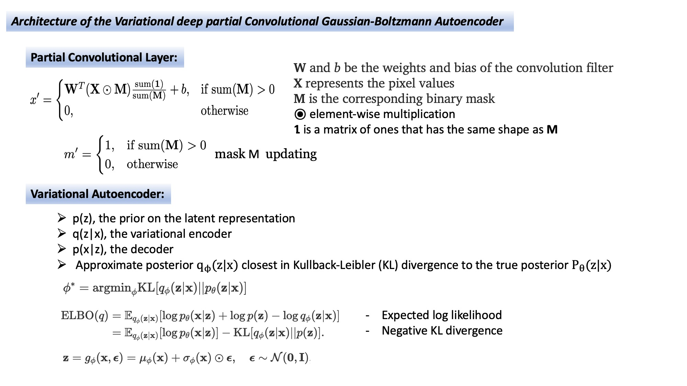
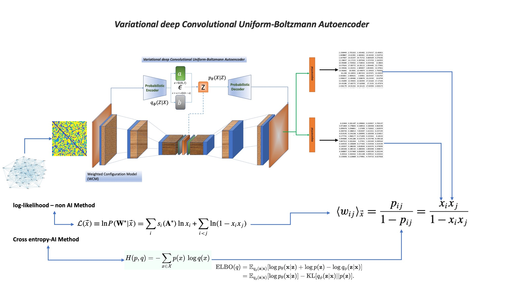

[](https://github.com/kbronik2017/Non_Euclidean_UCL/issues)
[](https://github.com/kbronik2017/Non_Euclidean_UCL/network)
[](https://github.com/kbronik2017/Non_Euclidean_UCL/stargazers)
[](https://github.com/kbronik2017/Non_Euclidean_UCL/blob/master/LICENSE)


# Variational Deep Learning models for non Euclidean structure
<br>
 
</br>
<br>
 
</br>

<br>
 
</br>
Click on the following link to access further information on mathematical presentation of variational autoencoder
https://github.com/kbronik2017/Non_Euclidean_UCL/blob/main/references/Auto-Encoding.pdf

<br>
 
</br>
<br>
 
</br>
Click on the following link to access further information on mathematics of analytical methods
https://github.com/kbronik2017/Non_Euclidean_UCL/blob/main/references/Squartini_2011_New_J._Phys._13_083001.pdf

# Undirected Configuration Model (UCM)


<br>
 
</br>


<br>
 
</br>

# Weighted Configuration Model (WCM)

<br>
 
</br>

<br>
 
</br>


# Reciprocal Configuration Model (RCM)


<br>
 
</br>

<br>
 
</br>

# Reonstruction Network (RCON)

<br>
 
</br>

# Parallel running


<br>
 
</br>


# Running the GUI Program! 

First, user needs to install Anaconda https://www.anaconda.com/

Then


```sh
  - conda env create -f train_test_environment.yml
  or
  - conda create --name idp --file clone-file.txt
``` 
and 

```sh
  - conda activate idp
``` 
finally

```sh
  - python  VAE_GUI.py
``` 

After lunching the graphical user interface, user will need to provide necessary information to start training/testing as follows:  

<br>
 
</br>


# Testing the Program (User Quick Start Guide) 
Examples of Training, Cross-validation and Testing subjects can be found in:
https://github.com/kbronik2017/Non_Euclidean_UCL/tree/main/training_testing_examples 
(which will allow users to quickly and easily train and test the program).
The results of testing(inference) can be found in the folders:
```sh
  - prediction_image_outputs
  and
  - matrix_output
``` 


